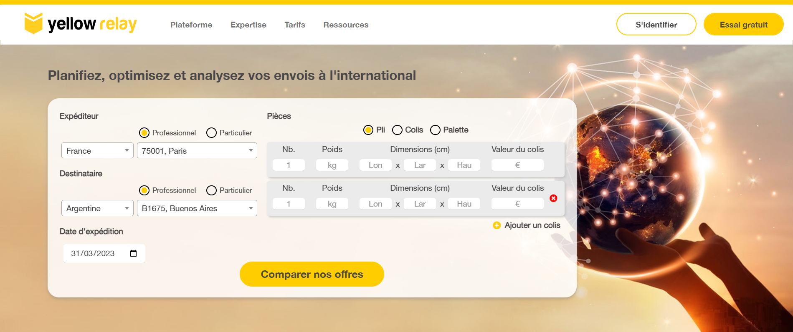

# Stage en entreprise - YELLOW RELAY
https://yellowrelay.com/

> ## Activités réalisées pendant le stage
>
>- Initiation à **Laravel** et à la structure **MVC** du site de l'entreprise
>- Refonte de certaines parties du site en **HTML-CSS-JS-Bootstrap**
>- Création d'éléments dynamiques en **JS**
>- Utilisation de **Lang de Laravel** pour y stocker le texte en français
>- Utilisation de **FileZilla** pour le download ou l'upload des fichiers du serveur

> **Note** : *Tous les travaux réalisés ci-dessous ne sont pas encore intégrés au site de production de Yellow Relay. Ils sont pour le moment intégrés au site de test.*

 

## Refonte du formulaire de simulation

### *Avant*

### *Après*

>- L'ajout et la suppression des colis sur fait en **JS**
>- Les menus déroulants de ce formulaire sont fait avec la library **Select2**

 

## Refonte de la page des offres

### *Avant*

### *Après*

>- Les filtres et les tris ont été codés en **JS**
>- Le menu déroulant des tris est fait avec la library **Select2**

 

## Refonte du formulaire de connexion

### *Avant*

### *Après*

>- L'affichage du formulaire en fonction du bouton sélectionné a été codé en **JS**

 

## Réalisation de la fenêtre des moyens de paiement

